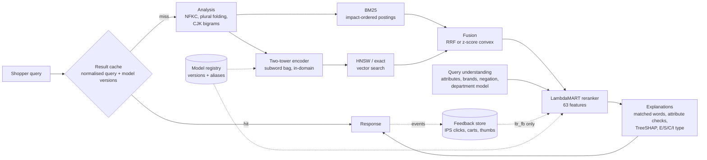

# Phase 2 — retrieval, ranking and serving architecture

## Components

| Component | Module | What it does | Why this design |
|---|---|---|---|
| Analysis | `search/analysis.py` | Normalisation, digit/letter split, en/es plural folding, CJK character bigrams, subword features | One pure-Python implementation serves indexing and queries, so they cannot drift. Units are mapped to terms once per *unique* unit (sparse product), ~20x faster than per-occurrence work. |
| BM25 | `search/bm25.py` | Precomputed per-term impact weights in a CSC matrix | A query is a sum of a few posting lists; ~1 ms on 1.2M products single-threaded. Japanese works without a dictionary. |
| Dense encoder | `search/dense.py` | Siamese bag of word + character n-gram embeddings, trained with in-batch softmax and ESCI hard negatives (Irrelevant / Complement for the same query), typo augmentation | Pretrained multilingual models were not reachable from the build environment. A domain-trained subword model is cheap (CPU, numpy), handles typos and Japanese, and is the honest baseline for "does semantic retrieval help on this data". A `sentence_transformers` backend plugs into the same interface. |
| Vector search | `search/dense.py` | Exact inner product below 200K products, faiss HNSW above | Exact is faster for small corpora; HNSW recall/latency is benchmarked against exact (`csre bench`). |
| Fusion | `search/engine.py` | Reciprocal-rank fusion, or convex combination of z-normalised scores with alpha tuned on dev | RRF needs no tuning; score fusion uses score magnitudes. Both are evaluated. |
| Spelling correction | `search/spell.py` | Symmetric-delete index over each market's catalog vocabulary; a word the catalog has (almost) never seen gets its one-edit neighbour that appears 20x more often, added to the query (expand mode) | A typo cost every ranker ~0.23 nDCG@10; correction halves that. Words that sellers also misspell (in up to 50 products) are corrected when the neighbour is 200x more frequent: typo penalty −0.127 → −0.112 with clean queries unchanged (`eval_full_test_spell_rare*.json`). Expand beats replace on dropped-word variants and keeps rare brands. Ablation: `data/reports/eval_full_test_spell_*.json`. |
| Filters | `search/engine.py` | Department / stock / price masks applied inside retrieval: masked BM25 postings; HNSW oversamples and post-filters, falling back to exact masked search | Vague queries get department refinements without a second index. |
| Query understanding | `search/query.py` | Phase-1 attribute extractors (bulk offline, cached online), brand dictionary, negation scope, query → department model | Same expressions offline and online; department entropy flags vague queries. |
| Reranker | `search/features.py`, `search/train.py` | LightGBM LambdaMART with ESCI gains as label gains; content-only and feedback-aware variants | Trees use attribute match / *conflict* features directly, and TreeSHAP gives exact per-result explanations. |
| Result types | `search/train.py` | Multiclass LightGBM: Exact / Substitute / Complement / Irrelevant | Lets the storefront label results as exact matches or substitutes. |
| Registry | `search/registry.py` | Versioned model directories, `production` / `candidate` aliases, lineage | Responses report versions; cache keys include them; `csre promote` rolls forward or back. |
| Keys | `search/analysis.py` | `query_key`: sorted bag of normalised words, for the result cache and the feedback store | Every ranker is a bag-of-words model, so reordered queries share results and feedback. |
| Serving | `serve/` | FastAPI, result cache, latency budget with degradation (reranker → hybrid → BM25), semantic rescue for zero keyword matches, feedback events | The cheap fallback is always available and every degradation is reported in the response. |

## Evaluation protocol

* **Splits** — trained on ESCI train queries, tuned and early-stopped on dev (10% of train, by query), reported on
  the untouched ESCI test split.
* **Rerank mode** (ESCI task 1) — every method ranks each query's judged products. All results are labelled, so
  nDCG@10 is exact. This isolates *ranking* quality.
* **Retrieval mode** — every method ranks the full catalog. Products not judged for a query are unknown, not
  irrelevant: we report condensed nDCG@10 (unjudged removed), a lower bound (unjudged = 0), judged@10 and recall
  of the query's Exact products at 100.
* **Slices** — locale, ambiguous / underspecified / multi-intent, negation, spec, brand, sparse product
  descriptions, ESCI hard queries, query length, traffic bucket.
* **Uncertainty** — 95% paired-bootstrap intervals for every difference from BM25.
* **Latency and cost** — single-threaded wall-clock per request (warm process), per-stage breakdown, and a
  compute-only cost model (`configs/search.yaml: cost`).
* **Robustness** — one-off query variants from the phase-1 replay stream (typos, dropped / reordered words,
  modifiers, case) scored against the parent query's labels.
* **Feedback** — the feedback-aware ranker reads clicks simulated *from the same labels*, so its offline gain is
  simulator-dependent. It is reported separately from content-only rankers, and offline relevance is never
  presented as conversion impact.

## Running at scale

* All bulk work streams or shards; analysis runs in a process pool; parallel evaluation forks workers that share
  the loaded indexes copy-on-write (query parsing is primed in the parent because Polars is not fork-safe).
* `csre bench` builds a 2.5M-product shard (real catalog + phase-1 distractors) and measures it; larger
  catalogs are served as shards searched in parallel, with projected latency, memory and cost per tier.
